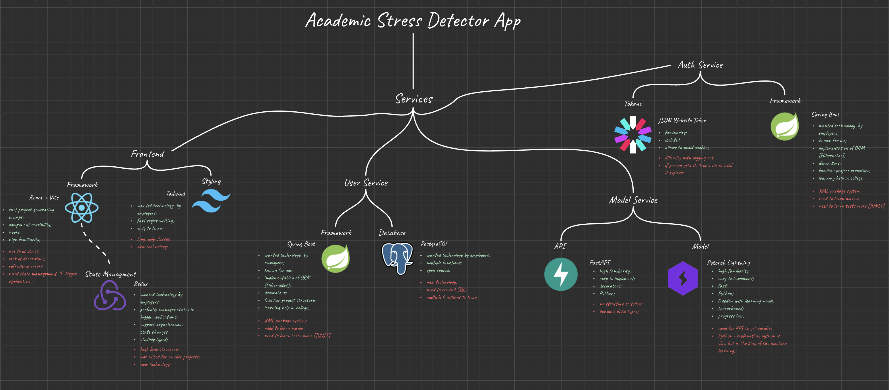
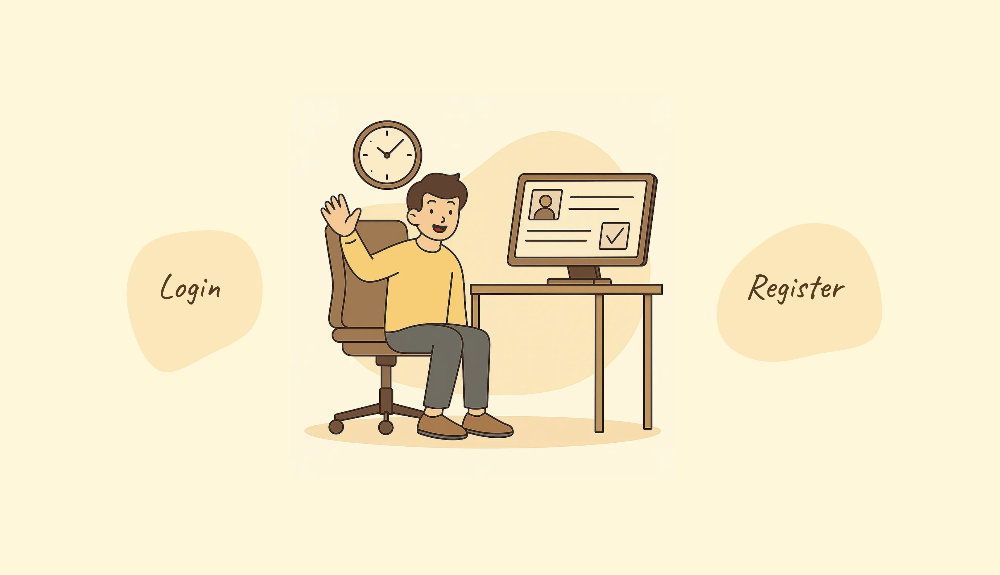
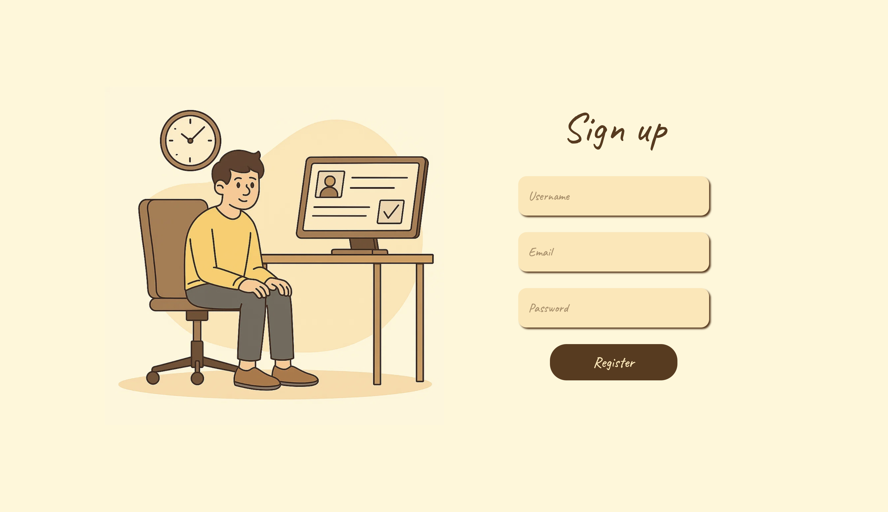
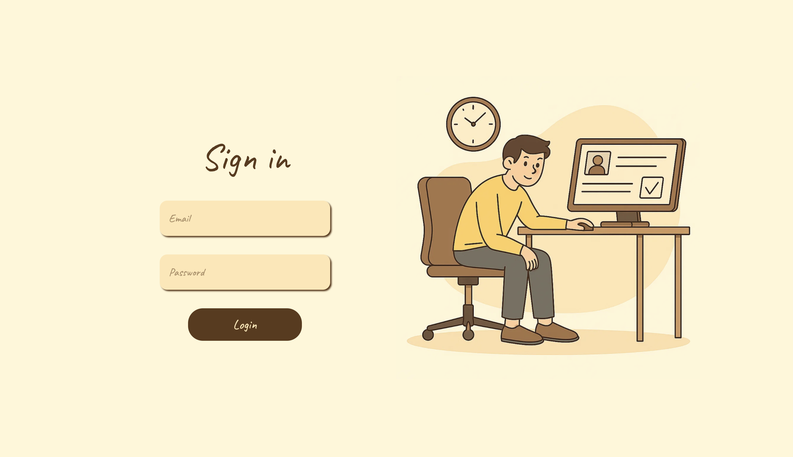
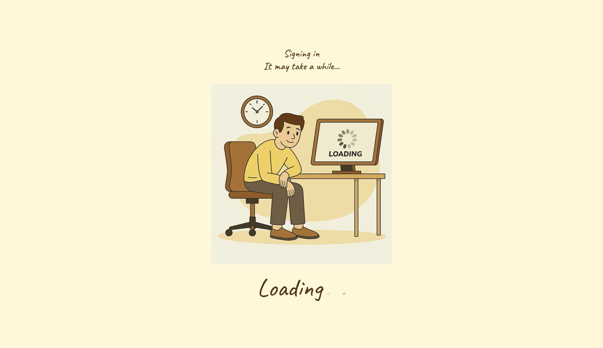
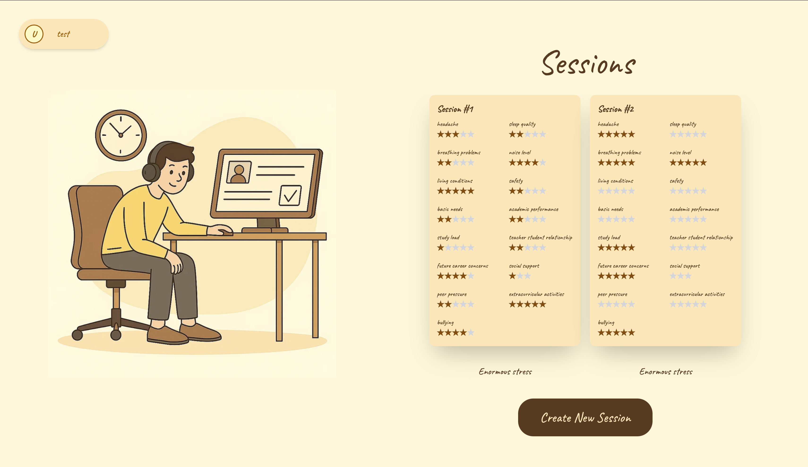
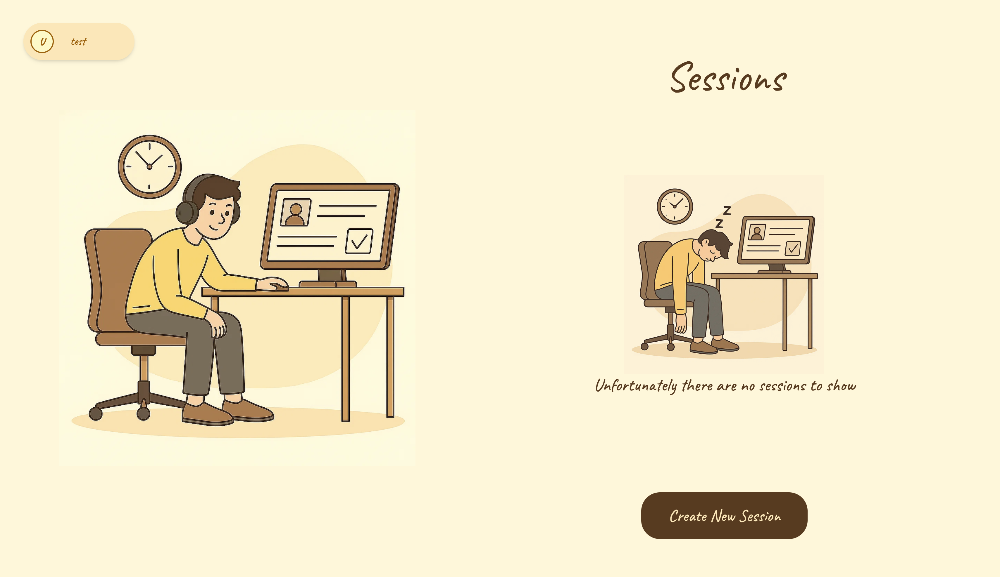
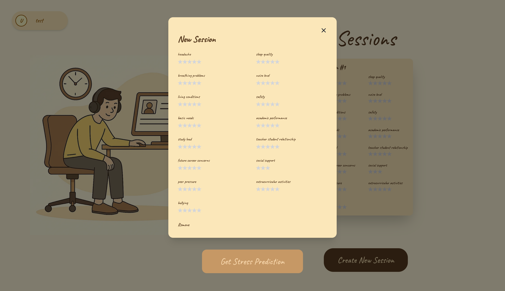
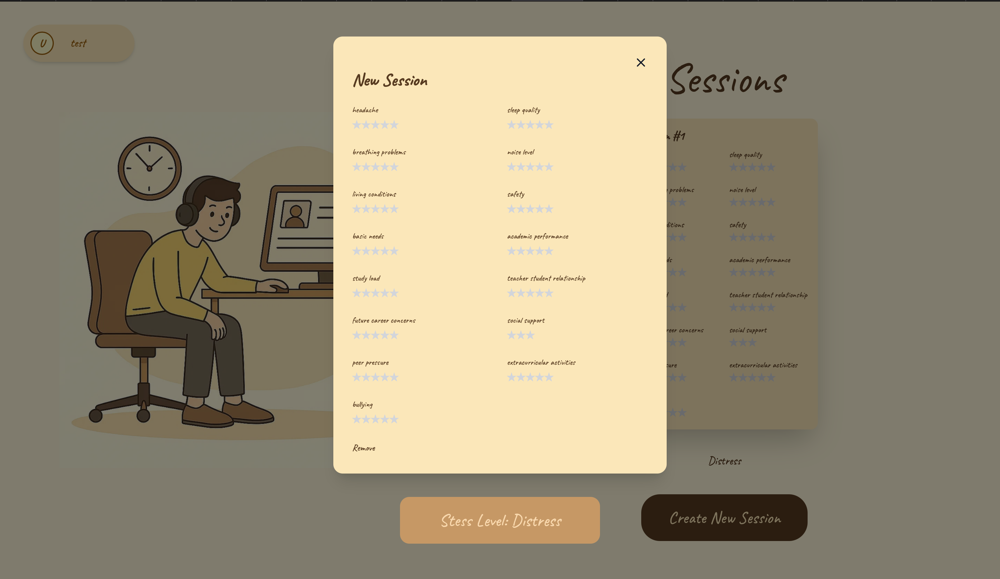
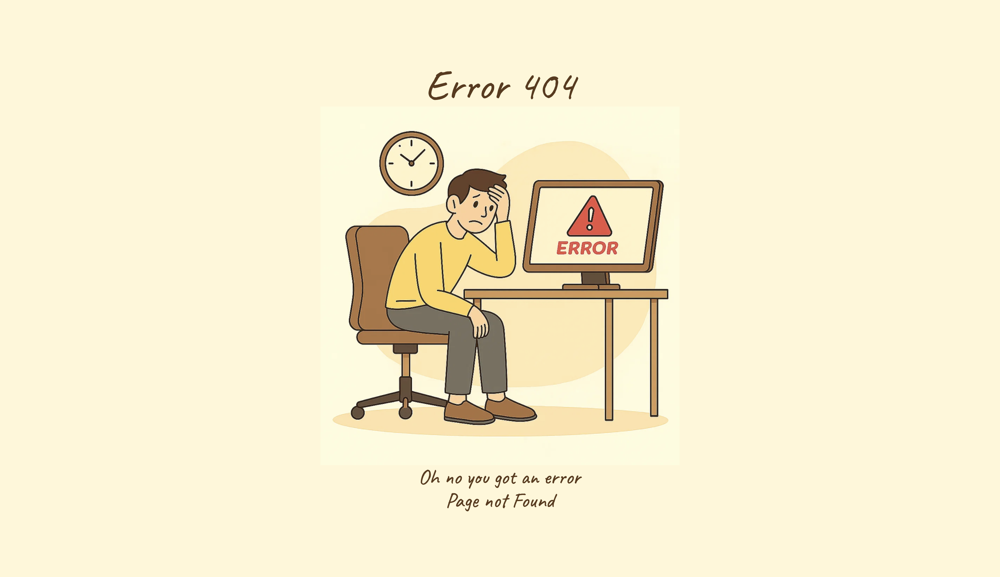

# 🧑‍🎓 Academic Stress Detector - Client Service

## 💡 Overview

Client Service of this application was built using Vite, React, Typescript, Tailwind and framer-motion. It's the visual core of this app and it coordinates auth and user services to achieve fast and secure data transfer. This project aim is to create software for predicting user stress level in each session based on user's personal feelings and conditions.




## 🗒️ Pages

### Welcome Page


### Register Page


### Login Page


### Loading Page


### Home Page




### Session Modal




### Error Page


## 🗒️ Features
* Redux based state managment system that saves sessions to local storage;
* Request Token Authorization;
* Clarity in design;
* Animations created in framer-motion;

## ⚙️ Command Tools

To work with this project locally or in a containerized environment, use the following commands:
```bash
npm run build # builds the project

npm run dev # run the project in developer mode
````

## 🧠 Tech Stack
<p align="center">
  <a href="https://skillicons.dev">
    
  </a>
</p>
 
